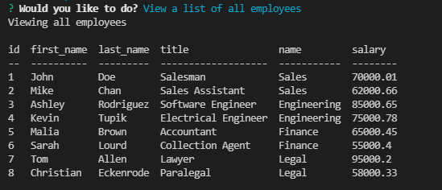

# Title: Employee Tracker

## Descrption:

Command line application build for managers that tracks employees.

## Table of Contents:

- [Installation](#installation)

- [Usage](#usage)

- [Screenshots](#screenshots)

- [License](#license)

- [Contributing](#contributing)

- [Tests](#tests)

- [Links](#links)

- [Questions](#questions)

## Installation

Copy repo data to your computer and run "npm i" in the root folder of the app.

## Usage

To start the program type "node server.js" and follow the prompts.

## Screenshots

## License

This application is covered by the MIT license. Click the link for more information.

[https://opensource.org/licenses/MIT](https://opensource.org/licenses/MIT)

## Contributing

Mark Raudenbush

## Tests

Further testing will need to be performed.

## Links

You can access my GitHub profile throught the following link.
[My GitHub](https://github.com/markraud)

Or use this link to go directly to the repo.
[The application's GitHub repo](https://github.com/markraud/mysql-employee-tracker)

## Questions

Please email with any questions.
[markraud@hotmail.com](mailto:markraud@hotmail.com)
